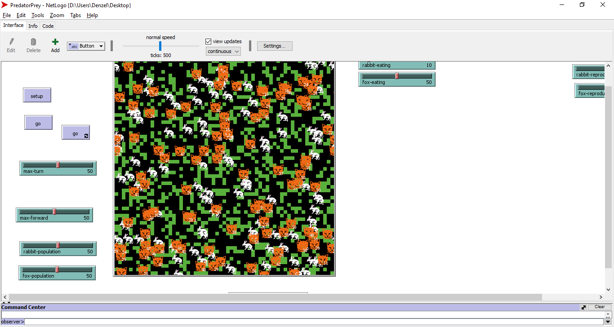

# PredatorPrey

## Installation
Before using the program, install the latest version of Netlogo [here](https://ccl.northwestern.edu/netlogo/).

## About
A simple predator prey model that uses foxes and rabbits as the agents. The environment in which the agents roam are within a 30 by 30 grid in which the green patches symbolizes the grass and the black patches are marked as eaten grass. The rabbits survive by eating the grass, while the foxes survive by eating the rabbits. The table below contains the initial population of both agents.

| Agents	  | Population  |
| ----------- | ----------- |
| `Foxes` 	  | 50			|
| `Rabbits`   | 50			|

The rabbits will starve to death after `10` ticks, and the foxes will starve to death after `50` ticks. Both agents will have a `1/30` chance to create a new offspring, and have a turn and forward radius of `50`.

## Usage
Click on `Setup` to generate the environment and agents. Press `Go` to start the program and it will stop at 500 ticks. To run the program indefinitely, press `Go 🔁`.

## Authors
Caoile, Sean
Lim, Aurelius
Tan, Gavin
Yongco, Denzel
